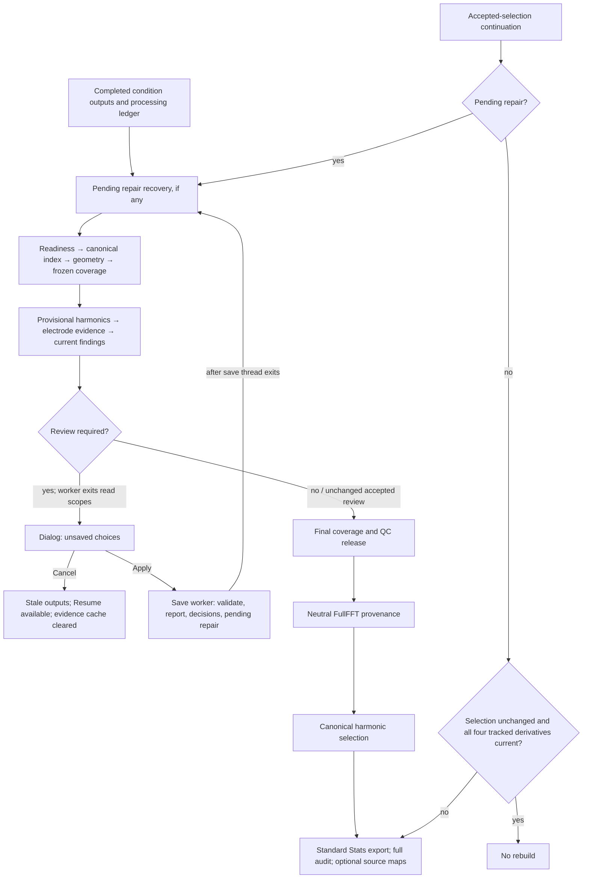

# Postprocessing QC: performance and review investigation

Implementation follow-up (2026-09-08): the user approved the final recommended
first batch. Its implementation and final validation are tracked in
[QC Performance](../exec-plans/active/qc-performance.md#postprocessing-review-readiness-and-audit-parsing-2026-09-08).
The report below is the frozen pre-implementation investigation; its timings,
line references and no-production-edit statements describe that earlier phase.

Investigation date: 2026-09-08. Starting branch: `codex/postprocessing-qc-v3`.
Frozen baseline: `c44665827da158de0643758b4bbb999b26d8b6b2`.
Starting `git status --short`: only `?? outputs/`; no tracked modifications.
The investigation adds diagnostic harnesses, evidence receipts and this report.
It does not change production code, user decisions, scientific settings or real
project data. Existing untracked outputs and root `.fpvs_cache` are preserved.

The strongest first UX change is to make **ready to submit** mean that choices,
required artifact confirmations and broad-scope consistency all pass. The
current dialog can show all choices made while submission is still invalid.
Keep the existing grouping, filtering, undo and asynchronous save. The narrow
performance candidate is repeated exact frequency-token conversion inside one
BCA audit-table parse; measurements and limits follow below.

## Scope and evidence

Read the agent index, architecture map, local PySide6, project-path and legacy
skills, active QC and bitwise-performance plans, preprocessing review-experience
report, and focused GUI, threading and postprocessing contracts. The local
pytest-qt skill informs proposed CI coverage only. Source inspection, profiling,
synthetic mutations and verification are distinct evidence classes here.
No local Qt, pytest-qt, offscreen application, BDF processing, FHC redesign or
`Standalone_Scripts` access occurred. No web research was needed for this
repository investigation; no scientific-method recommendation is made.

Source references below name files relative to the repo and verified baseline
line numbers. The baseline source remains unchanged, so `git show
c4466582:<path>` provides the exact implementation under investigation.

## Current workflow and ownership



1. **Completed outputs are evidence, not release.** The processing ledger
   records expected recording × condition outcomes and current export receipts.
   Native `.fpvs` anchors and historical XLSX are supported; native siblings
   take precedence. Canonical participant/group/recording/session identity
   comes through `Main_App.projects.dataset_index`, not output-folder labels.
   Worker `post_processing_pipeline_worker.py:459–505` checks output readiness,
   builds an index, validates current montage/mapping against completed outputs,
   and builds/persists pre-review ROI coverage before preparing findings.
   Ready and partially retained cells receive source integrity checks even if
   a later frequency-QC decision excludes them. That is a required gate.

2. **Frequency evidence is provisional and descriptive.**
   `frequency_domain_qc.py:297–674` resolves eligible sources and locked
   harmonic-profile inputs, attaches independent processing-ledger evidence,
   builds provisional harmonics, reads exact selected BCA columns and their
   availability audit, then constructs signed sums, absolute review bands,
   findings, source identities and decision fingerprints. Technical-invalid
   computable values block release; method-unavailable values remain explicitly
   unavailable. The threshold flag does not prove artifact or exclude data.
   Removed ROI/cohort screening stays removed: current cohort arrays are empty.
   Current defaults are warning above 10 µV, strong above 50 µV and extreme
   above 250 µV; the report carries the actual configured thresholds.

3. **Review ends the worker's read/validation scopes.** At worker `:208–230`,
   review-required returns a report to the GUI. The dialog owns unsaved choices
   keyed by exact finding fingerprints. Sorting/filtering changes presentation,
   not scientific identities. Prior choices are context; new/reconfirmation
   findings start undecided. Cancel discards edits, clears provisional reuse,
   marks outputs stale and enables Resume (`processing_workflows.py:837–901`).

4. **Apply saves off the GUI thread, then recomputes current QC.**
   `frequency_domain_qc_handoff.py:39–170` and
   `frequency_domain_qc_decision_worker.py:35–85` already run save-time revalidation,
   report generation, persistence and metadata reread to a QThread. The dialog
   still performs its first decision validation synchronously in `accept`
   (`frequency_domain_qc_dialog.py:155–158`); the save path revalidates. The shell
   shows Saving QC Decisions; continuation waits for thread exit, not just the
   result signal. Save failure exposes the error and Resume. Accepted Retain
   can reuse unchanged evidence/decisions; effective exclusions can change the
   cohort and legitimately require reconfirmation. Cache source/key/save-time
   annotations alone do not reopen review. The existing oscillation guard and
   64-iteration bound remain authoritative. Only explicit decision save writes
   `Frequency_Domain_QC_Review.txt`; ordinary review and automatic sync do not
   regenerate that text report.
   Text and manifest are not a single atomic transaction: text is written
   before the direct manifest write (`frequency_domain_qc.py:1124,4495`). A text
   file alone is not proof decisions were saved; preserve original failure and
   stale-state reporting, and verify partial-save recovery before changing this
   boundary. No interrupted real save was induced in this investigation.

5. **Repair must precede release.** Enabled condition-electrode interpolation
   requires explicit artifact confirmation. It does not edit BCA cells.
   `condition_interpolation_executor.py:132–267` validates the prepared/source
   context, persists pending intent, regenerates affected condition outputs,
   reconciles receipts and clears pending state only when complete. Changed
   source/settings can require Processing again; failed repair stays pending.
   Worker `:163–196` checks repair before either resume route, and a performed
   repair cancels the accepted-selection shortcut. Preserve reference/order,
   exact analyzed intervals and required reprocessing. Repair interpolates the
   requested electrodes in retained condition intervals and reapplies average
   reference; other EEG channels in those intervals can therefore change
   (`condition_electrode_interpolation.py:119–165`). Explain this before Apply.

6. **Release, provenance and selection have different authority.** Worker
   `:544–576` applies current decisions to frozen coverage and saves the final
   QC-20 release. It publishes/revalidates processing-owned neutral FullFFT
   provenance before canonical harmonic selection (`:758–842`). FHC depends
   on that neutral provenance and original FullFFT, not the selected standard
   harmonic list. A provenance failure stops selection; a selection failure
   stops its consumers while valid upstream provenance remains useful.

7. **Separate core completion from optional exports.** Required steps are
   frequency QC, neutral provenance, harmonic selection and standard Stats-ready
   export. Full-audit and both existing source-map modes are optional sibling
   exports; one failure must not erase successful siblings or relabel an old
   artifact current. Repeated-session projects explicitly skip participant-keyed
   Stats-ready and source-map producers, preserving old files; recording-aware
   full-audit still runs. Do not change this classification implicitly.

8. **Accepted-selection resume is narrower than full QC resume.** Worker
   `:343–457` can skip rebuilding only when selection is unchanged and all
   four tracked derivatives are current, including optional exports. The
   current check has no repeated-session applicability filter, so absent
   skipped Stats/source artifacts can prevent the shortcut. Otherwise it
   rebuilds derivatives. A normal
   full pass still writes the harmonic summary and exports. Failed publications
   preserve/restore preceding artifacts with failed/stale freshness for the
   required fingerprint. An ordinary selection-only continuation uses processed
   results/source-ready derivatives; pending repair is the important exception.

9. **Cancellation is not uniform.** Dialog Cancel and the non-cancellable
   save transaction are explicit. The postprocessing worker itself has no
   cooperative cancellation API. Generic Resume nevertheless enables Stop
   Processing (`processing_workflows.py:936–937`); `stop_processing:1096–1105`
   only supports the multiprocessing runner and otherwise says processing will
   finish normally. Fix misleading affordances before promising cancellation.
   Adding cancellation would need checkpoints and publication/failure tests.

## Optimizations already present

| Owner | Actual reuse, bounds and invalidation | Remaining cost / scope limit |
| --- | --- | --- |
| `io.xlsx_selected_reader:50–102,230–281` | Explicit read scope; exact path/stat/file identity, sheet, ordered columns, electrode filter and missing-column policy; detached frame/header returns; pre/post admission check. | Ordinary selected-frame/header/manifest dictionaries have operation lifetime but no byte/entry LRU. Native/companion paths return before the XLSX frame cache. No process-lifetime cache. Nested read scopes replace rather than share the current cache. |
| `io.spectral_data:220–299` | Four dense numerical payloads; up to 256 verified headers and 262,144 unique header labels with shared immutable tuples. Signature/declaration must match; first read verifies SHA/schema/grid. | A numerical miss hashes/loads all declared dense sheets even if a header record survives. A bounded selected request does not imply bounded archive I/O. New worker scopes revalidate. |
| `io.condition_data:262–343` | Four compact payloads; up to 256 verified schemas; selected blocks avoid unrelated audit/dense tables. | Schema hits avoid repeated first-load validation, but evicted requested numerical blocks still load. Returned frames remain caller-owned. |
| `full_fft_grid_qc`, `spectral_eligibility` | Eight exact header/rate calculations (32,768 labels/header); sixteen immutable eligibility domains (256 harmonics). Oversized inputs use unchanged calculation. | Pure numerical/domain reuse never replaces source, protocol or exported-row validation. |
| Worker + public project index | Pass one index between QC, selection and exports; wrong-root supplied index is rejected. | Current release/index guards deliberately rediscover canonical identity; `roi_coverage:1052–1109` and `harmonic_selection_qc:699` mean this is not one total directory scan. |
| `post_processing_context:23–117` | 32 entries total, nested scopes share, source snapshots checked on admission/hit, deep copies in/out; release and accepted-selection semantic keys retain cohort/settings/decision authority. | Hits still hash dependencies and detach. Artifact-freshness bookkeeping alone is ignored by selection keys. Scope exit disposes entries on success/review/error. |
| `frequency_domain_qc:3441–3547` | One successful independent-ledger context per namespace; bounded 32 MiB snapshot/8 MiB object admission; exact parsed bytes and live-path check protect replacement/change-and-back. | Missing/invalid/oversized cases retain normal loader behavior. Hit capture/check/detachment still costs; this optimization is already implemented. |
| `provisional_harmonic_cache:24–175` | Explicit two-entry review-flow object; ordered scientific inputs and actual anchor/companion SHA; stored-evidence digest, detached results, generation prevents admission after clear. | No report/decision caching. Hits still hash eligible inputs; miss keys are checked before/after calculation. Two entries bound count, not an independent byte cap. |
| Harmonic/audit calculation paths | Harmonic loader removes unused attrs on its owned frame; guarded exact means/noise reductions and read reuse already exist. Audit parser already avoids per-row Series for unique columns. | Do not recommend these again. The main summed-BCA loop still retains its scalar validation and `pd.Series(...).sum()` reduction. |

The scopes close before memory-intensive source-map work. The GUI owns and
clears the two-entry provisional cache at review-flow completion/cancel/error;
source maps have their separate export-owned compatibility index. More memory,
cross-run reuse or extra workers are not inherently improvements.

## Measurements and reproducibility

The available MCCTR project supplied 24 participants, six conditions, 143
available condition cells and seven current electrode findings; its saved
review was already accepted. Real-project checks used `.venv` CPython 3.13.9,
NumPy 2.3.1, pandas 2.3.0, SciPy 1.16.0 and Windows 11 build 26200. NumPy/SciPy
OpenBLAS 0.3.29/0.3.28 both reported one thread. `PYTHONHASHSEED=0` was set;
native-thread environment limits were established before scientific imports.
CPU-heavy benchmarks and tests were serialized.

The complete **backend preparation bundle** executes the worker's actual
readiness, index, geometry, pre-review coverage and frequency-review functions.
Only coverage persistence is disabled (`persist=False`), and no Qt shell is
constructed. A Python audit hook rejects project write/create/replace/delete
operations. There were no blocked-write attempts, and `project.json` SHA-256
remained `1c7b4f636989f8b04959d83a12004815fc2d7653b9dd2273f88e0b40bf1a1d30`.
The hook covers these Python I/O paths, not arbitrary native code/external
processes; current source validators remain enabled. No real source data were
changed to create an unaccepted review.

Three paired trials alternate baseline/candidate order (B/C, C/B, B/C).
Each variant starts a new provisional cache, then repeats with the same
evidence object but **new workbook/validation scopes**, matching a resumed
worker's ownership. The older harmonic cache and OS cache are available in
both variants; “new evidence” is not an empty application or cold physical disk.
No OS cache was flushed. Table entries are unprofiled median [minimum–maximum]
seconds; these are observed prototype effects, not implemented improvements.
Lower-level accepted/durable harmonic selections may be reused; these real
trials do not force a first-ever adaptive harmonic calculation. The fresh
synthetic workflows below and existing adaptive tests cover different cases.

| Complete backend preparation | Current baseline | Table-token prototype | Median reduction |
| --- | ---: | ---: | ---: |
| New provisional evidence | 30.999 [30.396–31.102] | 28.549 [28.254–28.552] | 2.451 s / 7.9% |
| Reused evidence, new worker scopes | 21.835 [21.740–21.968] | 19.289 [19.091–19.397] | 2.546 s / 11.7% |
| Absolute-screening substage, new evidence | 9.468 [9.370–9.483] | 6.891 [6.871–6.921] | 2.577 s / 27.2% |
| Absolute-screening substage, resumed | 9.432 [9.365–9.487] | 6.893 [6.768–6.912] | 2.540 s / 26.9% |

The individual complete-stage pair savings were 1.847/2.550/2.746 s for new
evidence and 2.649/2.439/2.679 s for reused evidence. There are only three pairs,
so ranges characterize observed variation, not confidence intervals or a
universal guarantee. The first new-scope trial's earlier readiness/geometry
work was faster, making helper and total differences appropriately different.

Baseline substage medians show where time remains:

| Stage | New evidence | Reused evidence | Interpretation |
| --- | ---: | ---: | --- |
| Readiness / dataset index / geometry | 0.117 / 0.426 / 0.933 s | 0.113 / 0.418 / 0.925 s | Small individual costs; no validation-bypass recommendation. |
| Coverage, without publication | 4.799 s | 4.885 s | Complete source checks remain material; the old 12-cell probe was not a cohort measurement. |
| Canonical inputs | 3.356 s | 3.365 s | Eligibility parsing and canonical validation persist. |
| Independent ledger evidence | 0.137 s | 0.138 s | Already efficient here; no extra ledger cache proposed. |
| Provisional harmonics, including validation/keying | 11.227 s | 2.002 s | Existing reuse works; all six baseline/candidate resumes hit. A hit is not free. |
| Absolute screening | 9.468 s | 9.432 s | Dominant remaining resumed substage; narrow parser prototype measured above. |
| Report integrity | 0.444 s | 0.447 s | Small here; no full-report caching proposal. |

These nested medians must not be summed as if they formed a single trial.
User review wait, Qt construction/updates, thread startup/handoffs, coverage
publication, decision save, actual repair, final release/provenance publication,
workbook serialization and optional source work are outside this bundle.
The roughly nine-second existing evidence-reuse benefit is not added to the
prototype's percentage to predict full-pipeline duration.

Logical read/hash counts were identical between baseline and prototype for
each state: new evidence used 2,288 `.fpvs` opens, 1,573 `.npz` opens and 1,438
`hashlib.file_digest` calls totaling 5,504,645,337 input bytes; resumed evidence
used 1,287 / 1,144 / 723 and 2,067,584,366 bytes respectively. Project manifest
opens were 20 versus 13. These are Python opens and this specific hash API's
byte totals, **not physical disk bytes**, and omit other hashing APIs. They
show the prototype preserves reads and hashes; they do not justify removing
integrity checks. More granular hit/eviction rates are not inferred from opens.

Sampled process RSS (20 ms polling) ranged 356.7–363.8 MiB for baseline new
evidence and 358.7–364.4 MiB for prototype new evidence; resumed ranges were
312.5–335.6 and 325.5–337.3 MiB. CPU medians were 29.406→26.781 s and
20.766→18.203 s. RSS includes allocator history and retained prior results;
the prototype is not a demonstrated memory reduction. Its token map is limited
to 256 short strings per table, never a cohort of arrays.

A separate clean cProfile pass (no concurrent RSS sampler) attributed 14.305
of 50.678 profiled seconds to 143 complete BCA audit parses and recorded
375,232 exact-frequency conversions. Profiling overhead is substantial:
**do not use those elapsed values as ordinary trial timings**. An initial
profile combined with the RSS thread produced inconsistent function totals;
it was discarded and replaced by the clean profile. The clean pass shows
143 spectral payload misses/286 verified-header lookups: source key building
still validates all dense archives once in that new scope. Four-entry dense
churn is a plausible later target, not a demonstrated cache-size improvement.

The loaded-table helper benchmark used 64 electrodes × 41 exact frequency
tokens (2,624 audit rows), five alternating pairs. Current parser median was
12.328 ms [11.469–12.643]; prototype 6.876 ms [6.709–7.860], a 44.2% helper
reduction. Conversions fell from 2,624 to 41. This excludes I/O and must not be
multiplied into an end-to-end prediction. Ordered outputs and input-frame bytes
matched. Edge checks covered duplicate/malformed columns, missing/failed reads,
changed frequency/status/reasons, numerical/nonfinite/custom-object fallback,
128/129-character tokens, more than 256 unique tokens, error precedence,
warnings and exception cleanup. The candidate also passed 87 existing
non-Qt audit/integrity/review/reuse/repeated-session tests while installed only
inside a temporary diagnostic process.

Across all 12 real preparation runs, the complete type-tagged ordered report,
coverage fingerprint and outcome fingerprint shared digest
`5c7307e899eef506f12872e23fccb941f556db0488c4ef479ae54f9b37bdb5a7`.
The sole normalized report field was `generated_at`, frozen before both paths;
Python float values are compared by packed bytes and container types/order
remain distinct. No numerical algorithms, decision fingerprints or other
timestamps were normalized. This proves this cohort's observed report parity,
not universal source-array/export equivalence for an unimplemented change.

Four separate small workflows—flat/repeated-session × XLSX/native, four cells,
two electrodes and a fixed two-harmonic profile—provided 20 cached/uncached
complete-report comparisons across fresh, unchanged, Retain/save/resume,
changed source and changed condition decision. All ordered report/float bits
and saved report-text presence/bytes matched; source hashes were unchanged
outside the explicit synthetic mutation steps. Repeats and Retain hit the
provisional cache; each source/exclusion change recomputed. Fourteen additional
lifecycle assertions passed for mutation, same-stat content changes, replacement,
corruption/missing companions, eviction, clear during work, failure and ledger
retarget/change-and-back. Scopes were empty after exit. These fixtures bypass
upstream geometry/provenance exactly as their existing unit-test helpers do;
they are not a full worker, repair or release-chain benchmark. The tiny fixed
calculation often costs less than cache validation—for example flat native
Retain/resume was 0.205 s cached versus 0.186 s uncached in its single pair.
Use those timings as a warning against speculative caching, not a stable
performance estimate.

Finally, the real read-only **index + accepted release/selection + Stats frame
preparation** operation was measured in three fresh/same-scope pairs, with
unchanged code and no parser prototype:

| Accepted-selection operation | New scope, median [range] | Same scope, median [range] |
| --- | ---: | ---: |
| Whole measured operation | 28.917 [28.018–29.031] s | 15.276 [15.143–15.280] s |
| Index + release | 9.296 s | 0.953 s |
| Accepted selection load | 8.756 s | 3.310 s |
| Stats frame preparation | 10.949 s | 11.008 s |
| Sampled process peak RSS | 365.1–371.9 MiB | 352.1–360.6 MiB |
| `.fpvs` / `.npz` opens | 4,004 / 572 | 2,431 / 143 |
| `file_digest` calls / bytes | 2,189 / 2,278,717,247 | 1,467 / 401,113,510 |

All six operations returned 432 rows across the same four frames, with exact
frame order/values/dtypes and numeric-column bytes; numeric digest
`aa661726b261a8ab27b1b473fdf4758193552325427e027ee1e2fe0f041648f8`.
The manifest SHA remained unchanged and no write was attempted. This confirms
existing scoped reuse benefits the validation chain; repeated Stats preparation
is still about eleven seconds. No new optimization or formatted XLSX-writing
speedup is established here. Selective failed-artifact retry and further
validation reuse remain proposals requiring their own profile/parity evidence.

Machine-readable trial rows, counts and correctness outcomes are in
[postprocessing-qc-v3-evidence.json](postprocessing-qc-v3-evidence.json).
The isolated helper and synthetic reproducers remain at
`.codex-tmp/postprocessing-qc-v3/benchmark_audit_candidate.py` and
`benchmark_synthetic.py`; `run_candidate_pytest.py` installs the prototype only
for the named existing test files. Their raw receipts and transcript are in the
same scratch directory. Run each serially with native-thread limits set to one.

Reproduction uses the checked-in manual harness and baseline checkout:

```powershell
$env:PYTHONHASHSEED = '0'
& ./.venv/Scripts/python.exe scripts/manual_diagnostics/investigate_postprocessing_qc.py <project-root> .codex-tmp/postprocessing-qc-v3/reproduction --trials 3 --audit-candidate scripts/manual_diagnostics/postprocessing_qc_audit_candidate.py
& ./.venv/Scripts/python.exe scripts/manual_diagnostics/investigate_postprocessing_qc.py <project-root> .codex-tmp/postprocessing-qc-v3/reproduction-profile --profile
& ./.venv/Scripts/python.exe scripts/manual_diagnostics/investigate_postprocessing_qc.py <project-root> .codex-tmp/postprocessing-qc-v3/reproduction-exports --stage exports --trials 3
```

Use new output directories; the harness refuses to overwrite a prior receipt
or put diagnostic output inside the real project. On CachyOS select the local
`.venv/bin/python`; that platform and installer timing remain unmeasured. Raw
receipts/profiles are under ignored `.codex-tmp/postprocessing-qc-v3/`; portable
summary receipts accompany this report. Harness setup/imports and parity
comparison are outside measured functions, while read/hash counting overhead
is present equally in both variants.

## Review experience: findings and proposed interaction

The current `frequency_domain_qc_dialog.py` already uses shared AppDialog,
StatusBanner, SubsectionHeaderLabel, ColumnFilterMenu, ActionRow and buttons.
It defaults to 1180×780 with 1000×650 minimum; a flat splitter separates the
five-column table from detail tabs, with table/text-native scrolling. This is
static evidence of layout intent, not visual validation at 1280×900.

| Finding | Source evidence | Recommendation / confidence |
| --- | --- | --- |
| “Choices made” can disagree with readiness. | Dialog `:720` counts nonempty combo values, including unconfirmed interpolation. Backend `frequency_domain_qc:848` rejects unconfirmed repair; `:921–967` rejects inconsistent broad exclusions. | Count missing choices, confirmations and conflicts separately; Next needs attention should reveal/focus the exact hidden invalid target. Code-demonstrable gap; frequency in real use unmeasured. |
| Error recovery lacks target focus. | Apply is enabled at dialog `:339`; accept `:159` shows generic warning without selecting the invalid row. Checkbox toggle `:642` only invalidates undo. | Keep backend validator authoritative; add an I/O-free presentation assessment and targeted focus. Update status when confirmation changes. |
| Consequences are mainly action labels/tooltips. | Dialog `:176,477,620`; full identity/evidence text at `:889`. | Show what Retain, whole-condition/recording/participant exclusion or repair will do, and that changes are unsaved until Apply. Retain adds no exclusion from this finding; it does not certify clean data or reverse independent exclusions. |
| Broad scope requires repeated matching choices. | Per-row broad options versus backend consistency gate; group bulk at `:487` offers only retain/interpolate across one electrode's flagged conditions. | Later add an explicit scope preview and apply-to-listed-findings action with Undo. Preview the whole scientific exclusion scope, including unflagged outputs affected by a whole-condition/participant decision; never silently propagate a dropdown change. |
| Hidden group members can be replaced deliberately. | Group panel `:439` already lists every member and includes hidden flags, even if the table has zero matches; one-level Undo `:483–522` is implemented. | Preserve current semantics. Add visible hidden/replaced counts near action; pending-only as a later explicit option is a usability hypothesis, not a correction to target identity. |
| Close loses unsaved review edits. | No reject/close draft persistence; cancellation at `processing_workflows:871–894` correctly leaves stale/Resume. | Add unsaved-state and Cancel review wording first. Session draft recovery requires evidence/failure validation; do not silently restore stale choices or add an unnecessary confirmation flow. |
| Remaining GUI I/O and Stop mismatch. | Completion `processing_workflows:724–733` reads tools, marks current and rereads; worker already marks current before provenance. Cancel also writes stale state. Stop behavior described above. | Honest phase controls first. Consider returning authoritative final metadata in worker receipt later; actual UI stall is unmeasured. Heavy Apply saving is already off-thread. |
| Construction/update scaling is unmeasured. | One detail widget page per finding; row lookup `dialog:735` scans rows, including repeated bulk updates. | CI/visible profile 10/100/1000 findings before model/view migration. Static complexity is a hypothesis, not a measured bottleneck. |

Concrete exclusion consequences: a condition excludes all electrodes of the
exact participant/recording-condition; a recording excludes all its conditions;
a participant excludes all its recordings and conditions, including unflagged
outputs. These are downstream exclusions and preserve the original processed
files (`frequency_domain_qc.py:1467–1494,1672–1743`). A scope preview must convey
that effect, not just count flagged rows whose choices need to agree.

Selection already survives visible sorting/filtering by original index and
fingerprint. If filtered out, the first visible finding is selected; clearing
filters does not restore a formerly hidden selection. Next undecided already
traverses the global sorted list, clears filters/switches sections as needed
and focuses the decision control. Review-context tab switches back to Finding
evidence on selection (`:678`); preserving it is a low-priority preference to
evaluate, not a proven defect. Existing asynchronous save raises the main
window once and waits for thread exit; repeated focus-stealing is not a finding.

Proposed sketch, retaining the current dialog dimensions and shared components:

```text
Experimental Summed-BCA Review
Large responses identify findings to inspect; they do not establish artifact.
14 choices made | 2 need confirmation | 1 conflict | 3 pending hidden
+ Findings (~55%) ----------------+ Review (~45%) ------------------------+
| Individual electrodes / Other   | Participant / recording / condition   |
| Group [All v]  Search [       ]  | [Evidence] [Scope] [Review context]    |
| Clear filters                   | Signed/absolute value and review band |
| Existing five-column table      | Exact harmonics; analyzed interval    |
|                                | Independent evidence or Unavailable   |
|                                | Decision [v]                          |
| Native table scrolling         | Consequence: exact affected scope     |
|                                | Artifact confirmation, when required  |
|                                | Optional reason; Next needs attention |
+--------------------------------+---------------------------------------+
Unsaved review choices                         Cancel review | Apply & Continue
```

This is an interaction proposal, not a rendered screenshot. Keep logical tab
order, arrow navigation, complete identity tooltips and native content scroll;
do not add whole-page scrolling or nested cards. A future evidence tab replaces
existing content space; detailed traces stay in a focused dialog.

### Suitable evidence visuals, if a later prototype establishes user benefit

| Visual | Source / meaning | Limits and loading cost |
| --- | --- | --- |
| Per-harmonic BCA or stored spectrum | Exact recording-condition-electrode source via public Main_App selected condition/spectral readers; annotate provisional included harmonics separately from technical eligibility and base harmonics. | Report does not currently carry every per-harmonic value. FullFFT response distribution and independently stored FullSNR are descriptive; no new selection or artifact authority. A dense miss hashes/loads the full archive before selecting; load on request in a worker, with source-bound cache and explicit unavailable state. |
| Source trace inspection using QcSignalViewer concepts | Exact source recording, retained occurrence/time coordinates, channel identity and analysis stage; existing viewer has bounded detail and background worker. | `qc_signal_view.py:415` prepared mode is pre-interpolation/final-reference, not final analyzed signal. A new postprocessing adapter must label that distinction. Detail has 30 s/250,000-sample limits, but source SHA before/after can read the whole BDF. Do not preload all recordings or describe a missing trace as clean. |
| Electrode location / repair-support context | Validated retained BioSemi64 geometry and exact condition-specific proposed/confirmed repairs; small QPainter map in `qc_repair_support.py`. | No dense signal read when geometry/decisions exist. Donor distance is not spline weight or proof of repair accuracy. Never combine different conditions' repairs or substitute default geometry for validated geometry. |
| Full Publication Maps tool | Current tool expects accepted selection/cohort and performs aggregate/publication work. | Unsuitable here: wrong individual/provisional context, downstream dependency and unnecessary rendering/export cost. Do not embed its generation workflow. |

Optional previews need one bounded worker request, stale-result rejection,
explicit loading/corrupt/missing/unavailable states, cancellation and safe
cleanup. Compare all decision/release/export outputs with viewer opened versus
closed. No visual may introduce ROI-level summed-BCA screening or automatic
decision authority.

## Ranked recommendations

| Rank | Recommendation / evidence | Expected benefit | Risk and scope | Required acceptance |
| --- | --- | --- | --- | --- |
| 1 | Accurate ready-to-submit state, Next needs attention and targeted validation focus; code-proven confirmation/conflict mismatch. | Direct reduction in review dead ends; user time not measured. | Low–moderate; dialog + pure review model, existing validator unchanged. | Exact choices/receipts; hidden invalid targets revealed; checkbox updates; keyboard/size CI smoke. |
| 2 | Visible consequence/scope/unsaved copy and honest phase/Stop controls; existing UI/code mismatch. | Clearer exclusion/repair/save/continuation expectations, no extra data loading. | Low; shared components and orchestration text/state. | Flat/repeated scope correct; retain never means “artifact-free”; save lifecycle and cancel recovery preserved. |
| 3 | Bounded exact frequency-token reuse within one BCA audit parse; measured complete-stage prototype. | About 2.45–2.55 s per preparation in this cohort, 7.9–11.7%; not a full-pipeline estimate. | Low–moderate; one parser plus frozen-baseline edge/fallback tests. | Identical full reports, byte-sensitive evidence and call order; unchanged source reads/validation; bounded map and failure fallback. |
| 4 | Explicit broad-scope apply with affected-output preview and reversible choice map. | Fewer repetitive rows for a deliberate whole-scope exclusion; unmeasured. | Moderate; existing dialog/model/bulk authority. | Same as hand-entered choices, no silent scope expansion, hidden/replaced counts, reason/undo parity. |
| 5 | One requested spectrum or geometry-context view; existing text lacks direct inspection linkage. | Potentially easier evidence assessment; usability hypothesis. | Moderate–high; exact source adapter, worker, bounded result owner and UI. | Source/decision/output parity with view open/closed, no new authority; delayed/corrupt/cancel/late-result CI checks; measured load cost. |
| 6 | Investigate canonical-validation/copy costs, GUI completion I/O and selective failed-export retry separately. | Unknown until target-specific paired measurements. | Moderate–high; source authority, freshness and publication boundaries. | Preserve ABA/current-cohort rejection, detached ownership and artifact rollback; no new broad cache from static suspicion alone. |

## Strict equivalence and acceptance protocol

Freeze this commit and all scientific inputs/decisions before implementation.
Run baseline and candidate in separate controlled processes when changing
numerical/runtime ownership; alternate paired order, serialize CPU-heavy runs
and record native pool identities. Use identical roots or explicitly document
root-only provenance normalization and independently validate original receipts.

* Arrays: exact dtype (including byte order), shape, channel/frequency/participant
  ordering, signed zero, NaN/Inf payloads where present and floating-point bytes.
  Compare warning category/message/order and exception type/message/precedence.
  Tolerance tests alone do not qualify. Keep every reduction and summation order.
* Evidence and decisions: type-tagged ordered full payloads, exact thresholds,
  selected/included harmonic lists, flags, findings, unavailable/technical status,
  identity, confirmation authority, analysis/source/decision fingerprints and
  reconfirmation behavior. Opening a viewer or sorting/filtering must not alter
  these. Broader UI actions must equal explicitly entering the same choices.
* Persistence/exports: final release and neutral provenance independent of
  standard selection; exact schemas, field/sheet/row/column ordering, values,
  styles and freshness/restore state. For XLSX compare decompressed ZIP members,
  with only specifically named creation/modification fields in
  `docProps/core.xml` exempt. Do not blanket-drop timestamps from scientific
  receipts or normalize formatting. No XLSX publication parity is claimed by
  a read-only DataFrame preparation benchmark.
* Reuse: test changed scientific settings/cohort/decision, changed bytes with
  restored size/mtime, replacement/file ID, retarget/change-and-back, missing or
  corrupt companion, mutation during calculation/detachment, caller mutation,
  capacity/oversized bypass, eviction, close/clear during active work, exceptions
  and failed publication. A failed optimization admission must fall back with
  current diagnostics; it must not make invalid sources valid.

For the table-token prototype, only exact builtin strings up to 128 characters
are candidates, with at most 256 entries owned by **one parser call**. Cache
the original converter's successful returned string, including its empty
result; retain every row, normalization point, warning and reduction. Other
types and over-limit tokens call the original converter. Local scope exit or
failure releases the map; source changes are naturally reread on every call.
No source-validation result or scientific decision is cached. Implementation
still needs independent frozen-baseline regression coverage and an admission
allocation-failure fallback; the prototype is not production-ready code.

## Staged implementation plan

1. **Review readiness and consequences.** Add a pure presentation assessment
   for missing choices/confirmations/conflicts, persistent counts including
   hidden findings, Next needs attention and exact invalid-control focus.
   Show scope/consequence and unsaved state; make Stop/Saving/Continuing labels
   honest. Keep existing validator/save worker and schemas. Acceptance: same
   submitted choice map yields exact existing receipts; filters/undo preserve
   targets; no GUI I/O added; minimum-size and keyboard CI smoke passes.
2. **Measured parser change only if the benefit survives final parity.** Move
   the bounded exact-token reuse into the current audit owner with fallback;
   add frozen baseline, malformed/custom-input, capacity, mutation and exception
   assertions. Acceptance: complete relevant-stage paired improvement without
   extra source reads or changed report bytes; no reduction/order changes.
3. **Evaluate one on-demand evidence view and retry improvements separately.**
   First profile requested spectrum read/geometry context and GUI construction
   in CI/visible sessions. Consider scope-consistent explicit bulk exclusion,
   worker-returned completion metadata and per-artifact failed retry only with
   exact freshness/publication recovery tests. Do not bundle an index/cache
   redesign or source-trace prefetch into the first batch.

Update the focused GUI description and stale historical status notes when the
implementation lands. This investigation changes no ownership/workflow, so
it records discrepancies here without rewriting architecture as if proposals
had already been implemented.

## Rejected or deferred ideas

* Replacing FFTs, lower precision, different reductions, approximate sums,
  looser noise/eligibility checks or altered harmonic profiles: incompatible
  with byte equivalence and locked scientific contracts.
* Reintroducing ROI/cohort summed-BCA screening, automatic artifact claims or
  stronger decisions from descriptive visuals: explicitly outside scope.
* Whole-report reuse after acceptance, skipping current source/coverage checks,
  treating an accepted selection as an unconditional export shortcut: can reuse
  stale decisions or miss corruption/required repair.
* Larger cohort-sized dense caches or parallel postprocessing consumers:
  no measured net benefit, potentially large memory/native-thread/disk cost.
  Four-entry churn alone is not evidence to retain a full cohort.
* Skipping audit rows just because a condition/electrode appears ineligible:
  only existing canonical eligibility can authorize skipping numerical work;
  required pre-review receipt/source integrity precedes reviewed exclusions.
  The measured token candidate still traverses all original rows.
* Replacing the current GUI table/model, bulk undo, or save handoff wholesale:
  existing features work and GUI latency is unmeasured. Optimize measured
  operations, not static complexity in isolation.
* Rewriting unchanged human-readable QC reports less often: ordinary review
  already does not rewrite them. Selective derivative retry remains separate
  from that disproved hypothesis.

## Material documentation discrepancies

* `architecture/gui.md:32–33,59–60,80–87` still describes a ROIs tab, ROI
  choices and ROI smoke despite current electrode/Other-only presentation and
  explicit legacy ROI omission. Its later removal section and QC-17 amendment
  supersede that history. Do not restore features to match stale prose.
* `exec-plans/active/qc-performance.md:416` refers to absolute/cohort review in
  a historical table; current cohort screen is removed. Earlier prospective
  reuse/row-parser improvements in these plans are already implemented.
* `exec-plans/active/bitwise-pipeline-performance.md:257–261` still says an
  old extension awaits merge; current baseline contains the later completed
  changes. Unrun visible smoke remains a limitation, not missing implementation.
* `post-processing-export-contract.md:101–107` needs a narrower explanation:
  same-fingerprint preservation belongs to the accepted-selection/all-current
  path; normal full runs regenerate exports and pending repair overrides that
  route. Existing code is the authority for this investigation.
* The preprocessing review report explicitly excludes postprocessing and
  describes completed improvements. Its bounded inspection, clear consequences
  and reversible actions are precedents to evaluate, not missing work to copy.

## Verification and visible smoke

The bare `python` command initially resolved to an unavailable WindowsApps
alias. All executable checks below used `.venv/Scripts/python.exe`; the
verification driver confirmed that interpreter. Logs are retained under
`.codex-tmp/postprocessing-qc-v3/verify-*.txt`.

| Command / check | Result |
| --- | --- |
| `.agents/skills/pyside6-gui-cleanup/scripts/audit_gui_imports.py` | Passed. |
| `.agents/skills/legacy-boundary-review/scripts/audit_protected_edits.py` | Protected and removed-source-localization audits passed. |
| `.agents/skills/project-path-audit/scripts/audit_hardcoded_paths.py` | Eight pre-existing findings in unrelated `outputs/`; unchanged. |
| `.agents/scripts/verify.py --scope processing --tier focused` | **1,846 passed, 5 skipped**, 59 existing synthetic FIR/stim warnings; driver completed successfully. |
| `.agents/scripts/verify.py --scope gui --tier focused` | **395 passed**; no local Qt execution. |
| Candidate installed only for the five existing audit/integrity/review/reuse/repeated-session files | **87 passed**; overlaps existing suites, not 87 additional unique cases. |
| Isolated parser oracle / workflow probes | Five helper timing pairs and edge/error/input assertions passed; 20 full-report comparisons and 14 lifecycle cases passed. |
| `.agents/scripts/verify.py --scope project-io --tier focused` | Stopped at the same eight `outputs/` path findings, before its tests. |
| `.agents/scripts/verify.py --scope repo --tier precommit` | Stopped at the same eight `outputs/` path findings, before the broad test phase. Not a passing gate. |
| Ruff + `py_compile` on the two new diagnostic scripts; whitespace check | Passed. |

No protected runtime path was edited or recreated. No hard-coded production
path was introduced or removed. Real workflow roots come from the active
project; the manual harness accepts a root argument and a separate diagnostic
output argument. The blocked broad gates leave repository-wide integration
coverage incomplete; targeted passes do not replace that missing coverage.
No local visual timing, screenshot/fit assertion, safe visible application
smoke, installer or CachyOS execution is claimed.

Existing registered CI targets are
`tests/gui/test_frequency_domain_qc_dialog_qt.py`,
`tests/gui/test_frequency_domain_qc_handoff_qt.py` and, if a viewer is added,
`tests/gui/test_qc_signal_viewer_qt.py` (`tests/qt_test_files.txt:8,9,21`).
Proposed extensions use fake reports/controllers: unconfirmed interpolation
remains attention-needed; toggling confirmation updates counts; broad conflicts
identify exact targets; Next reveals/focuses a hidden invalid row in sorted
order; decisions/reasons survive navigation; footer/actions fit the supported
sizes; Cancel preserves existing no-save/Resume behavior; successful saving
continues only after thread exit; failed save/stale-save keeps actionable error.
Later previews need delayed/corrupt/cancel/late-result and teardown coverage.
These new GUI assertions are recommendations, not tests implemented here.

Four new reviewable files are the final investigation artifacts:

* `docs/agent/reviews/postprocessing-qc-v3-investigation.md` (this report).
* `docs/agent/reviews/postprocessing-qc-v3-evidence.json` (trial and parity receipts).
* `scripts/manual_diagnostics/investigate_postprocessing_qc.py` (read-only stage harness).
* `scripts/manual_diagnostics/postprocessing_qc_audit_candidate.py` (isolated prototype).

Additional helper/synthetic scripts, profiles and logs remain in the ignored
scratch directory identified above. No commit, branch move, push or production
implementation was performed. The final tracked working tree is unchanged;
the four new files and original untracked `outputs/` are the only status entries.

Visible/manual path, **not executed**: on Windows 11 and CachyOS, open flat and
repeated-session reviews at 1280×900 and the 1000×650 dialog minimum with long
IDs/group labels. Navigate search/table/tabs/actions with keyboard; sort exact
values, intersect filters, create zero matches and reveal hidden pending,
unconfirmed and conflicting targets. Verify decisions/reasons remain attached
to exact finding IDs. Preview group scope, apply, undo and manually override.
Accept Retain; verify responsive Saving then Continuing with one focus return,
and unchanged accepted findings do not reopen. Exclude one condition/recording
and verify only the canonical intended scope changes; complete legitimate
reconfirmation. Exercise allowed repair, pending-repair failure/full-Processing
recovery, corrupt outputs, save failure, Cancel and Resume. Verify successful
FullFFT provenance remains usable after optional export failure and failed
artifacts remain stale. Test actual Stop messaging without assuming cooperative
cancellation. Compare saved outputs with the frozen baseline.

The most worthwhile first implementation batch is the readiness/consequence
work, paired with the narrowly measured parser improvement if its final
regressions pass. It fixes concrete review dead ends and avoids repeated pure
parsing without altering scientific authority, source validation or memory
ownership across stages.
